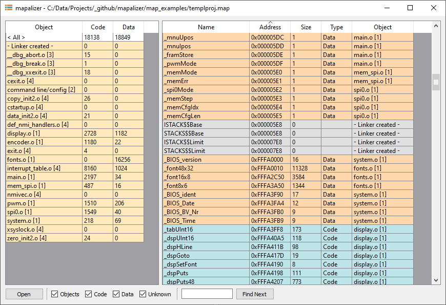

# mapalizer
A parser and viewer of linker-generated map files.



## What is a map-file

A linker map is a file produced by the linker. The file shows the symbols and sections contained in a binary. The linker also provides the memory address and size for each symbol. 

The map files are usually text files, where in most cases each line represents a symbol with its size and position in memory. In many cases the symbols are arranged alphabetically in the file, for example:

```
_dspCol                0x000005c2     0x1  Data  Gb  display.o [1]
_dspDataIdx            0x000005b0     0x2  Data  Gb  spi0.o [1]
_dspDataLen            0x000005b2     0x2  Data  Gb  spi0.o [1]
_dspFont               0x000005c3     0x1  Data  Gb  display.o [1]
_dspGoto               0xfffa417d    0x13  Code  Gb  display.o [1]
_dspHLine              0xfffa411b    0x62  Code  Gb  display.o [1]
_dspInit               0xfffa4875   0x22b  Code  Gb  display.o [1]
_dspIntCol             0x000005c0     0x1  Data  Gb  display.o [1]
```

## What is mapalizer

Mapalizer interprets the map files and extracts all information about symbols. This information is presented in a clear manner, giving the user a better overview of the memory organization.

The user has the option to:
- sort the symbols by name, address, size, type and section.
- filter the symbols by section.
- search a symbol by name.

Mapalizer can help you:
- identify the potential location of buffer overflows (by checking how the symbols are organized in memory).
- identify the most memory-expensive symbols and their sections.
- identify all memory used (or available) for data and code.

The following compilers/linkers are supported: IAR, Keil

## How to compile mapalizer

mapalizer was created in Qt5 + Microsoft Visual C

## How to run mapalizer

Windows: download the `bin/mapalizer.exe` and execute it.

## To do

- Add support for more compilers/linkers.
- Add support for other platforms.
- Add CSV export/import.
